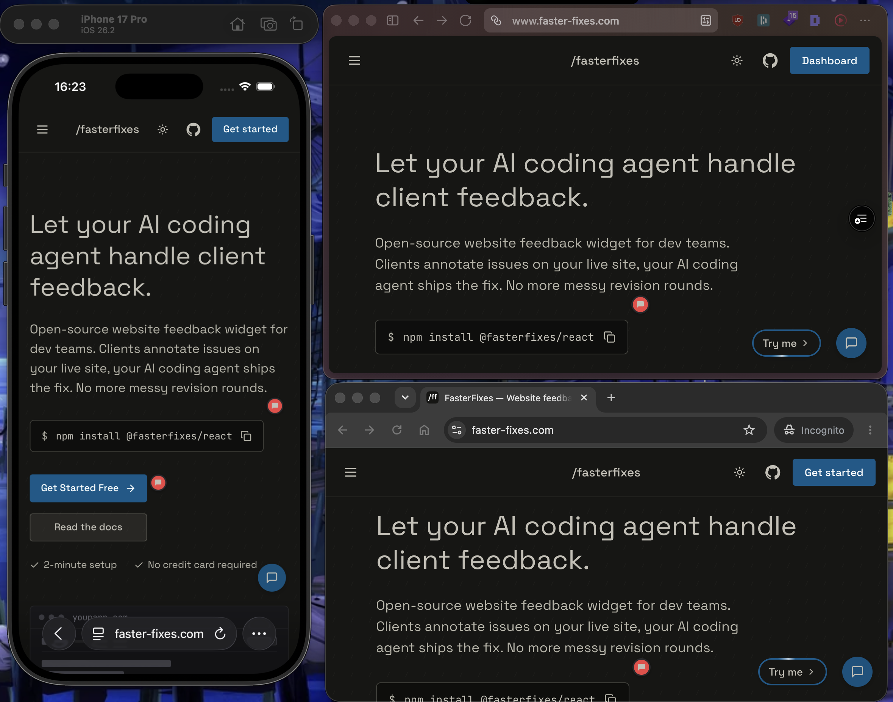
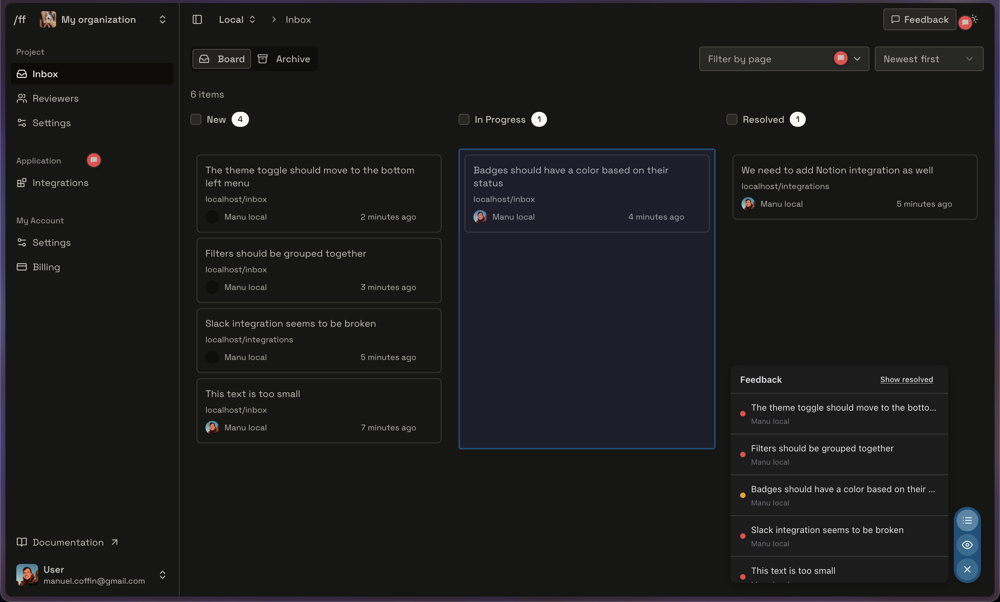

**TL;DR:** Most website QA checklists stop at "test your forms and check contrast." This one covers six sequential phases - Functional, Visual/Cross-Browser, Performance, Accessibility, Security, and Client Feedback - because sequence matters: running a Lighthouse audit before you have fixed broken auth flows is wasted effort. The client review phase is the most chaotic QA phase on any project and needs its own process. Playwright, Lighthouse CI, and axe-core can automate a meaningful slice of the rest in CI.

## What "website QA" actually covers

QA is not a single pass before launch. It is a set of verification activities distributed across the development lifecycle - some automated, some manual, some collaborative. For client-facing web projects, it has at least six distinct phases, each with different owners and different failure modes.

The phases are not interchangeable. Running a Lighthouse audit before you have fixed broken auth flows is wasted effort. Sending a staging URL to a client before you have done a cross-browser pass produces noise, not signal. Sequence matters.

What this guide does not cover: unit testing application logic, backend API contract testing, or load testing at scale. Those are real concerns, but they belong in separate runbooks. This is the checklist for the site itself - what a user, and a client, will actually encounter.

### QA when most of the code is written by an AI agent

A growing share of the code shipping today is generated, and a shrinking share of it is read line by line by the developer who ships it. That does not lower the bar for verification, it raises it: what used to be caught implicitly while writing or reviewing the code now has to be caught by an explicit check. Three levels, in order of cost:

1. **Code quality** - typecheck, lint, unit tests. Fully automatable, and the cheapest place to catch a regression.
2. **Architecture** - the rules a linter cannot express: folder structure, naming conventions, which layer is allowed to import which, where a data fetch belongs. Write them down as project rules and have the agent verify its own output against them before you look at it.
3. **Human QA on behavior** - the six phases below. If you are reading less code, you have to look harder at what the code does: every feature present, every feature working end to end, every edge case handled.

The third level is the one that cannot be delegated. The compensation is that the first two are now close to free, and edge cases are cheaper to enumerate up front, since an agent will list the side effects of a change before you implement it.

## Phase 1 - Functional QA

The baseline. If something does not work, nothing else matters.

- All forms submit successfully and trigger the correct server-side action (email, CRM write, webhook)
- Form validation fires on the correct events - `blur`, `submit`, or both - and shows field-level error messages
- Required field enforcement works with JavaScript disabled (server-side fallback)
- Auth flows complete end-to-end: sign-up, log-in, password reset, session expiry, log-out
- OAuth providers redirect correctly and handle token errors gracefully
- Protected routes return 401/403 for unauthenticated requests, not a blank page or a JS error
- All third-party API integrations are tested against staging credentials, not production keys
- API error states surface a meaningful UI message, not a raw JSON dump or a spinner that never resolves
- Edge cases are covered: empty states, zero results, maximum input length, special characters in fields
- File uploads enforce type and size limits on both client and server
- All internal links resolve to the correct destination (no `/undefined`, no 404s)
- All external links open in a new tab with `rel="noopener noreferrer"`
- Redirects are correct: old URLs to new URLs, HTTP to HTTPS, www to non-www or the reverse
- A 404 page exists and is styled; a 500 page exists and does not expose stack traces
- The cookie consent banner fires on first visit and respects the user choice across sessions
- Analytics and tag manager events fire on the correct triggers, verified in devtools or a debug mode

<Callout type="idea" title="My take: write the QA checklist when creating the issue.">

The list above covers the site, not the feature you shipped this week. So every issue I open - GitHub, Linear, whichever tracker - carries its own QA checklist: the steps a human walks through before the issue can be closed. Have an agent draft that list from the issue description; it is faster than writing it by hand, and it covers the edge cases you would have skipped.

</Callout>

## Phase 2 - Visual and Cross-Browser QA

Design-to-dev delta is real. Catch it before the client does.

### Browser matrix

Test against this minimum matrix before any client review:

| Browser          | Engine | Desktop | Mobile    |
| ---------------- | ------ | ------- | --------- |
| Chrome (latest)  | Blink  | Yes     | Yes       |
| Firefox (latest) | Gecko  | Yes     | -         |
| Safari (latest)  | WebKit | Yes     | Yes (iOS) |
| Edge (latest)    | Blink  | Yes     | -         |
| Samsung Internet | Blink  | -       | Yes       |

Add older Safari versions if your analytics show meaningful traffic there. Drop Samsung Internet if your audience is desktop-only.



_A cross-browser pass on this site: iOS Safari in the Xcode simulator, desktop Safari, and Chrome on the same page. Two engines and three viewports catch most of the delta; Firefox and Edge follow in the same pass._

### Checklist

- Layout renders correctly at standard breakpoints: 375px, 768px, 1024px, 1280px, 1440px
- No horizontal scroll at any breakpoint - check with `overflow-x: hidden` temporarily removed to expose the real cause
- Typography scales correctly: no orphaned words, no text overflow into adjacent elements
- Images are not stretched or cropped incorrectly, and none are missing `alt` text
- Hover and focus states are visible and match the design spec
- Animations and transitions do not cause layout shift or paint flicker
- Dark mode, if implemented, renders correctly across all components
- Custom fonts load - verify in the devtools network tab, and check the fallback stack if they do not
- Design-to-dev delta review: compare key pages against the design files at 1:1 zoom
- Visual regression baseline captured (Playwright screenshots, Percy, or Chromatic) before any post-QA changes

<Callout type="idea" title="My take: give iOS Safari its own pass.">

WebKit on iOS diverges from the rest of the matrix often enough to deserve a dedicated pass, and what breaks is rarely the layout - it is a detail that makes the page unusable. The one I hit most: an input with a font size under 16px makes iOS Safari zoom the viewport on focus, and the user is left panning around a form they cannot fill. Not owning an iPhone is not an excuse - the iOS Simulator that ships with Xcode on macOS runs the real WebKit build.

</Callout>

## Phase 3 - Performance and Core Web Vitals

Performance is a feature. These are the thresholds Google uses to classify pages:

| Metric                          | Good           | Needs improvement | Poor        |
| ------------------------------- | -------------- | ----------------- | ----------- |
| LCP (Largest Contentful Paint)  | 2.5 s or less  | 2.5-4.0 s         | Over 4.0 s  |
| INP (Interaction to Next Paint) | 200 ms or less | 200-500 ms        | Over 500 ms |
| CLS (Cumulative Layout Shift)   | 0.1 or less    | 0.1-0.25          | Over 0.25   |

Google measures at the 75th percentile of real-user sessions. A page passes only if all three metrics are in the good range at that percentile.

- Run Lighthouse on all key page templates - home, landing, blog post, product, contact - not just the homepage
- Identify the LCP element in the Lighthouse report, and preload it if it is an image
- CLS is 0.1 or below; identify layout shift sources with the CLS debugger in DevTools
- INP is 200 ms or below; long tasks over 50 ms on the main thread are deferred or split
- Total JavaScript bundle size audited; unused JS removed or code-split
- Images served in next-gen formats (WebP, AVIF) with explicit `width` and `height` attributes
- Lazy loading applied to below-the-fold images; the hero image is not lazy-loaded
- Font loading strategy set: `font-display: swap` or `optional`, depending on design requirements
- `Cache-Control` headers set correctly for static assets: long TTL plus a content hash in the filename
- CDN in place for static assets, verified in the response headers
- Third-party scripts (analytics, chat, ads) load async or deferred and none block the critical path
- Server response time (TTFB) is under 600 ms for the primary page template

## Phase 4 - Accessibility

WCAG 2.2 AA is the baseline. Not because of legal risk, though that is real, but because it is the minimum bar for a site that works for everyone.

### Color contrast requirements (WCAG 2.2 AA)

| Element type                                        | Minimum contrast ratio |
| --------------------------------------------------- | ---------------------- |
| Normal text (under 18pt, or under 14pt bold)        | 4.5:1                  |
| Large text (18pt and above, or 14pt bold and above) | 3:1                    |
| UI components (buttons, inputs, icons)              | 3:1                    |
| Decorative elements, inactive controls              | Exempt                 |

- Color contrast meets WCAG 2.2 AA ratios across all text and interactive elements, verified with a contrast checker rather than eyeballed
- All interactive elements are reachable and operable via keyboard alone
- The focus indicator is visible on every interactive element - the browser default is acceptable if not overridden
- Tab order matches the visual reading order
- All images have meaningful `alt` text; decorative images use `alt=""`
- Form inputs have associated `label` elements, not just placeholder text
- Error messages are programmatically associated with their input via `aria-describedby`
- The page has a single `h1` and a logical heading hierarchy with no skipped levels
- A skip navigation link is present and functional
- Screen reader test completed on at least one major screen reader (NVDA with Firefox, or VoiceOver with Safari)
- No content relies solely on color to convey meaning
- Video content has captions; audio content has a transcript
- The `lang` attribute is set on the root element, and language changes within the page are marked
- `prefers-reduced-motion` is respected: animations disabled or reduced when the user preference is set

<Callout type="idea" title="My take: accessibility work pays twice.">

Google does not rank a page on its WCAG conformance, but most of the list above produces exactly what a crawler reads: a single `h1` with a clean heading hierarchy, descriptive alt text, link text that means something out of context, labelled form fields, a correct `lang` attribute, captions and transcripts that turn media into indexable content. Do accessibility properly and you get, for free, the semantic markup an SEO audit would have asked for anyway. It is the one phase of this checklist where the effort is never wasted.

</Callout>

## Phase 5 - Security

Security QA is not penetration testing. It is the baseline hygiene every site should ship with.

- HTTPS enforced site-wide; HTTP requests redirect to HTTPS with a 301, not a 302
- HSTS header present: `Strict-Transport-Security: max-age=31536000; includeSubDomains`
- Content Security Policy configured, avoiding `unsafe-inline` and `unsafe-eval` where possible
- `X-Frame-Options: DENY` or `SAMEORIGIN` set to prevent clickjacking
- `X-Content-Type-Options: nosniff` header present
- `Referrer-Policy` set to `strict-origin-when-cross-origin` or stricter
- Dependency audit run with no critical or high vulnerabilities left unaddressed
- Environment variables are not exposed to the client bundle
- API keys and secrets are not committed to the repository, verified with a secrets scanner
- All user-supplied input is sanitized server-side before storage or rendering
- File upload endpoints validate MIME type server-side, not just by file extension
- Auth tokens stored in `httpOnly` cookies, not `localStorage`
- Rate limiting in place on auth endpoints: login, password reset, OTP
- Admin routes and staging environments are protected, not indexed, and not publicly accessible without auth

## Phase 6 - Client Feedback and Stakeholder Review

This is the phase that breaks most projects. Not because the site has bugs, but because the feedback process has no structure.

### Why client review is the most chaotic QA phase

By the time a staging URL goes to a client, the developer considers QA mostly done. The client considers it just starting. The gap between those two mental models produces feedback in email threads, feedback in Slack, feedback in WhatsApp, feedback in a shared document with no page references, and, inevitably, a screen recording that says "the button looks a bit off" without specifying which button, which page, or which device.

The result is that developers spend more time triaging feedback than fixing it. Issues get duplicated, lost, or misunderstood. Fixes get applied to the wrong element. The client re-reviews and finds the same issues, because the fix landed on the wrong instance.

Client review is a QA phase. It needs the same structure as every other phase.

<Callout type="idea" title="My take: gate client review, but do not use the gate to delay.">

Internal QA first - phases 1 to 5 done - and only then does the staging URL go to the client. Send a build that has not been tested internally and the client stops at the first visual defect, because nothing on a staging URL tells them which parts are finished; you then spend the whole review cycle explaining that this is not the final product, instead of collecting the feedback you actually needed. The opposite failure is worse: withhold the staging URL until everything is perfect and you risk having built, at high quality, a product the client never asked for. So client feedback has to come in as early and as often as the build allows. The sequence I hold to is: get the product to the highest quality I can reach on my own, then collect client feedback, then ship to production.

</Callout>

### How to collect visual feedback on a staging URL

The most effective pattern is annotated, pinned comments directly on the live staging environment - not screenshots pasted into a chat thread, not timestamped screen recordings, not bullet lists in a shared document.

A website feedback tool that lets stakeholders click any element and leave a comment - capturing the DOM element, URL, viewport size, and browser automatically - eliminates the "which button?" ambiguity entirely. The developer receives a report that already includes the exact element, the page state, and the feedback text. No back-and-forth to reconstruct the context.

A visual feedback tool goes further: annotated screenshots with pixel-level precision, attached directly to the element in question. That is the difference between "the spacing looks wrong on mobile" and a screenshot with a box around the exact gap, captured at a 375px viewport on iOS Safari.

Faster Fixes, the tool we build, is that layer: a widget you add to your staging build so stakeholders comment on the page itself, and every report reaches you with its element, URL, viewport and browser already attached. Installing it takes a component and a project ID - see the [quickstart](/docs/getting-started/quickstart).



_A review pass we ran on Faster Fixes itself. Each pin marks the element the comment was left on, the sidebar lists them in order, and the board behind shows the same items triaged. "This text is too small" is attached to the text in question, so there is nothing left to reconstruct._

- The staging environment is accessible to stakeholders without a developer manually sharing credentials
- The staging URL is protected from search engine indexing, via `X-Robots-Tag: noindex` or password protection
- Stakeholders have one single channel for feedback, not email and chat and a shared document simultaneously
- Feedback is collected with element-level context: URL, viewport, browser, DOM reference
- Each piece of feedback is triaged before it is actioned: duplicates merged, out-of-scope items flagged
- A review deadline is set and communicated before the staging URL is shared
- A feedback freeze point is defined: after this date, changes require a change request, not a QA fix

### How to turn feedback into tracked issues

Feedback collected on a staging URL is only useful if it becomes a tracked, assignable task. The client review workflow that holds up at scale looks like this:

1. The stakeholder leaves an annotated comment on the staging URL
2. The comment becomes a GitHub Issue or Linear ticket, with the screenshot, URL, and element reference attached
3. The developer picks up the ticket, fixes the issue, and marks it resolved
4. The stakeholder is notified and can re-review in context

The failure mode is step 2 being manual and inconsistent. If a developer has to copy-paste feedback from a chat thread into the tracker by hand, some of it will not make it. Bug tracking for agencies that integrates directly with the feedback collection layer removes that manual step entirely.

- Every piece of client feedback has a corresponding ticket in the project tracker
- Tickets include the page URL, element description, screenshot or annotation, browser and device, and expected versus actual behavior
- Tickets link back to the original feedback comment, not just a text description of it
- Fixed issues are marked resolved and the client is notified through a single channel, not ad hoc
- A final sign-off is documented - ticket comment, email, or a dedicated approval step - before launch is confirmed

<Callout type="idea" title="How I run this myself.">

I install Faster Fixes on the staging site: stakeholders leave feedback on the page itself, each report lands in GitHub Issues with the URL, the element, the viewport and the browser already attached, and once a batch has accumulated I hand those issues to a Claude Code agent to fix. I built that process because of what preceded it. On client projects the feedback channel was WhatsApp: photos of a screen taken with a phone, where I could not read the text I was supposed to fix, and messages like "the homepage is broken" with nothing else. Earlier, in web agencies and in larger companies, the feedback came through project managers who owned the client relationship but did not have the technical vocabulary to write a usable ticket, and the developers spent their morning decoding tickets before they could implement anything. The channel changes, the failure mode does not: context is lost between the person who saw the bug and the person who has to fix it.

</Callout>

## Automating parts of your QA checklist

Automation does not replace manual QA. It catches regressions so manual QA can focus on judgment calls.

**Playwright** is the right choice for functional and visual regression testing on modern stacks. It runs in CI, supports multiple browsers, and has a first-class TypeScript API.

```ts
// playwright.config.ts - minimal CI-ready config
import { defineConfig, devices } from "@playwright/test";

export default defineConfig({
  testDir: "./tests",
  fullyParallel: true,
  forbidOnly: !!process.env.CI,
  retries: process.env.CI ? 2 : 0,
  reporter: "html",
  use: { baseURL: process.env.BASE_URL || "http://localhost:3000" },
  projects: [
    { name: "chromium", use: { ...devices["Desktop Chrome"] } },
    { name: "webkit", use: { ...devices["Desktop Safari"] } },
    { name: "Mobile Safari", use: { ...devices["iPhone 14"] } },
  ],
});
```

```ts
// tests/auth.spec.ts - example functional QA test
import { test, expect } from "@playwright/test";

test("login form rejects invalid credentials", async ({ page }) => {
  await page.goto("/login");
  await page.getByLabel("Email").fill("notauser@example.com");
  await page.getByLabel("Password").fill("wrongpassword");
  await page.getByRole("button", { name: "Sign in" }).click();
  await expect(page.getByRole("alert")).toContainText("Invalid credentials");
});
```

**Lighthouse CI** gates performance and accessibility scores in your pipeline. Add this at the repository root:

```js
// lighthouserc.js
module.exports = {
  ci: {
    collect: {
      url: ["http://localhost:3000/", "http://localhost:3000/contact"],
      startServerCommand: "npm run start",
      startServerReadyPattern: "ready on",
      numberOfRuns: 3,
    },
    assert: {
      assertions: {
        "categories:performance": ["error", { minScore: 0.9 }],
        "categories:accessibility": ["error", { minScore: 0.9 }],
        "categories:best-practices": ["warn", { minScore: 0.9 }],
      },
    },
    upload: { target: "temporary-public-storage" },
  },
};
```

**axe-core**, via `@axe-core/playwright`, runs accessibility checks inside your existing Playwright tests:

```ts
import { test, expect } from "@playwright/test";
import AxeBuilder from "@axe-core/playwright";

test("homepage has no critical accessibility violations", async ({ page }) => {
  await page.goto("/");
  const results = await new AxeBuilder({ page })
    .withTags(["wcag2a", "wcag2aa", "wcag21aa", "wcag22aa"])
    .analyze();
  expect(results.violations).toEqual([]);
});
```

**Cypress** is a viable alternative if your team is already on it, and the `cypress-axe` plugin provides equivalent accessibility coverage. Playwright is preferred for new projects because of its native multi-browser support and faster CI execution.

What automation does not catch: design-to-dev delta, client feedback quality, stakeholder sign-off, and anything requiring human judgment about intent. Those stay manual.

<Callout type="idea" title="What I actually gate.">

On my own projects the hard gate is a pre-commit hook rather than CI: typecheck and unit tests both have to pass before a commit is allowed, and the commit is blocked if a single test fails or if the change introduced a type error. The hook only runs on the files modified since the last commit, not on the whole codebase - a full-codebase check gets slow enough that people start reaching for `--no-verify`, and a gate that gets bypassed is not a gate. Having to clear every error before you can commit sounds like friction, and it used to be; with an agent doing the fixing it is a non-event, and it keeps the quality floor of what enters the repository non-negotiable. Everything heavier - Lighthouse budgets, axe-core, the cross-browser matrix - runs in CI as a report I read, not as a blocker. That is my baseline on projects of moderate complexity, not a universal rule: the more complex the project, the more of these checks are worth promoting to a hard gate.

</Callout>

## How to write a good bug report when something fails

A bug report that says "the button does not work" is not actionable. A bug report that includes the URL, the exact steps to reproduce, the expected behavior, the actual behavior, the browser and OS, and a screenshot is.

The minimum viable bug report:

```
Title: [Page] - [Component] - [Behavior]
Example: /checkout - Submit button - Form submits with empty required fields

URL: https://staging.example.com/checkout
Browser: Chrome 126 / macOS 14.5
Viewport: 1440px

Steps to reproduce:
1. Navigate to /checkout
2. Leave the "Email" field empty
3. Click "Place order"

Expected: Validation error shown on the Email field; form does not submit
Actual: Form submits; server returns a 500 error

Screenshot or recording: attached
```

The structure is not bureaucracy. It is the minimum information a developer needs to reproduce and fix the issue without a round-trip. For a detailed breakdown of what makes reproduction steps useful, see steps to reproduce a bug.

## FAQ

### What is web QA testing?

Web QA testing is the process of systematically verifying that a website works correctly, performs well, and meets defined quality standards before it reaches end users. In practice it covers functional correctness, visual fidelity against the design, performance against Core Web Vitals thresholds, accessibility against WCAG standards, and baseline security hygiene. For client projects it also includes a stakeholder review phase where non-technical users verify the site against their expectations.

### How long does website QA take?

It depends on scope, but a rough heuristic for a mid-size marketing or e-commerce site is one to two days for a thorough manual pass across all six phases, plus however long it takes to triage and fix the issues found. Automated testing reduces the regression cost on subsequent builds to near-zero. Client feedback rounds typically add two to five days, depending on stakeholder availability and how structured the feedback process is.

### What is the difference between QA and UAT?

QA is developer-led verification that the site works as built. UAT, or user acceptance testing, is stakeholder-led verification that the site works as intended. QA happens before UAT. A site that fails QA should not go to UAT: you are spending stakeholder time on bugs that should have been caught internally. In practice, the client feedback phase described in Phase 6 is UAT, and the preceding five phases are QA.

### Do I need a website QA checklist for every project?

Yes, but the depth scales with project size. A five-page brochure site does not need a full Playwright suite or a formal UAT sign-off process. It does need a functional pass, a cross-browser check, a Lighthouse run, and a structured feedback round. The checklist stays the same; the automation layer and the formality of the process scale down. Skipping it entirely on small projects is how small bugs become launch-day incidents.

### What tools do developers use for website QA?

The common stack: Playwright or Cypress for end-to-end functional and visual regression testing; Lighthouse CI for performance and accessibility scoring in CI; axe-core for automated accessibility violations; BrowserStack or Sauce Labs for cross-browser testing on real devices; WebPageTest for detailed performance profiling; and a visual feedback tool for structured client review. The specific tools matter less than having a consistent process for each phase.

## Useful sources

- [WCAG 2.2 - W3C Recommendation](https://www.w3.org/TR/WCAG22/) - the authoritative specification for web accessibility standards
- [Core Web Vitals - web.dev](https://web.dev/articles/vitals) - Google's documentation on LCP, INP and CLS thresholds and measurement methodology
- [Lighthouse CI - Getting Started](https://github.com/GoogleChrome/lighthouse-ci/blob/main/docs/getting-started.md) - official setup guide for integrating Lighthouse into CI pipelines
- [Playwright - Writing Tests](https://playwright.dev/docs/writing-tests) - official documentation for the Playwright test API
- [axe-core - Deque](https://github.com/dequelabs/axe-core) - the open-source accessibility rules engine behind most automated a11y tooling
- [Understanding WCAG Color Contrast - MDN](https://developer.mozilla.org/en-US/docs/Web/Accessibility/Guides/Understanding_WCAG/Perceivable/Color_contrast) - practical explanation of contrast requirements with examples
